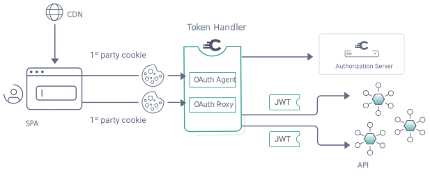
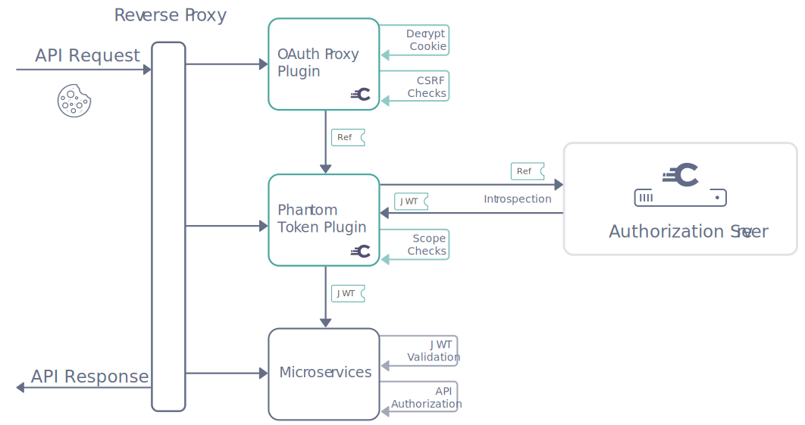

# Authentication

## Token Handler Pattern

> source: https://curity.io/resources/learn/token-handler-spa-example/

The Token Handler Pattern is a pattern that is used to provide a single point of authentication for a browser-based application. The Token Handler Pattern was used for the application as it is considered a best practice for browser-based applications as documented in [OAuth 2.0 for Browser-Based Apps](https://datatracker.ietf.org/doc/html/draft-ietf-oauth-browser-based-apps).

From the diagram the SPA refers to the [Frontend](../project-structure/apps/frontend) application. The Token Handler refers to the [OAuth Agent Service](../project-structure/services/oauth-agent-service). The JWT protected APIs refer to the [API Gateway](../project-structure/services/api-gateway). The Authorization Server refers to the [Curity Identity Server](../project-structure/services/curity-identity-server).

Further documentation around the OAuth Agent in this diagram can be found [here](../project-structure/services/oauth-agent-service).

## Token Handler Api Flow

> source: https://curity.io/resources/learn/token-handler-deployment-example/

1. The SPA makes a request through the reverse proxy. In the application the reverse proxy is the [Nginx Ingress Controller](../architecture/technologies/nginx-ingress-controller) service.
2. The OAuth Proxy Plugin is used to authenticate the user. It does this by decrypting the received auth cookie and extracting an Opaque access token from it. The Opaque access token is then sent to the Phantom Token plugin.
3. The Phantom Token plugin is used to exchange the Opaque access token for a JWT token with the [Curity Identity Server](../project-structure/services/curity-identity-server). This is known as [token introspection](https://oauth.net/2/token-introspection). The JWT token is then sent as a request authentication header.
4. The receiving service validates the JWT token and extracts the user's profile information from the token. The user's profile information is then used to authorize the user.
