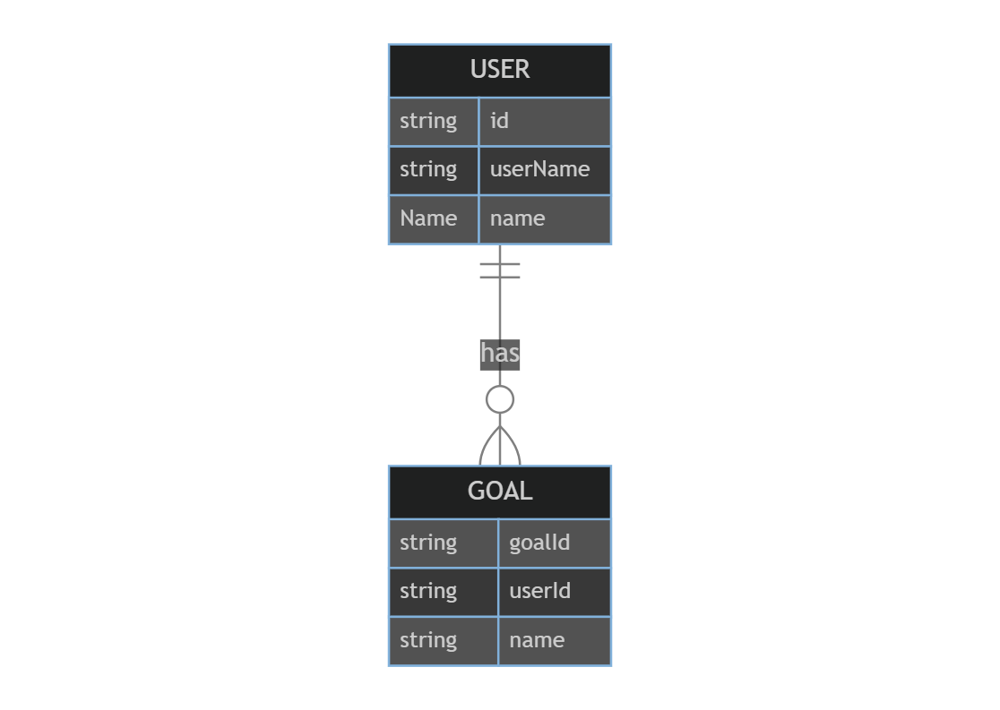

# Entity Relationship

## Entities
### User
```typescript
interface User {
  id: string;
  active: boolean;
  addresses?: Address[];
  displayName?: string;
  emails?: StringMultiValuedValue;
  externalId?: string;
  locale?: string;
  meta?: Meta;
  name?: Name;
  nickName?: string;
  preferredLanguage?: string;
  profileUrl?: string;
  roles?: StringMultiValuedValue;
  timeZone?: string;
  title?: string;
  userName: string;
  userType?: string;
  website?: string;
}
```

### Goal
```typescript
interface Goal {
  goalId: string;
  userId: string;
  name: string;
  target: number;
  progress: number;
  createdAt: string;
  updatedAt?: string;
  goalCompleted: boolean;
  completedAt?: string;
  goalDeleted: boolean;
  deletedAt?: string;
}
```

## Entity Relationship Diagram


