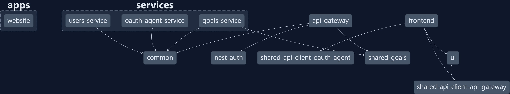

# Project Structure

The project was created using the [Nx](https://nx.dev/) monorepo tool. The project is organized into apps, services, and libraries. Nx is a tool that helps you develop full-stack applications using a monorepo. Nx helps you develop applications using a component-driven approach. Nx also helps you develop applications using a microservices architecture.

The frontend apps are built using [Angular](https://angular.io/). The backend microservices are built using [NestJS](https://nestjs.com/). The project is organized as follows:

## Apps

### [Frontend](https://github.com/marleypowell/goalie/tree/main/apps/frontend)

The frontend is an Angular single page application (SPA) that is built using the Angular CLI. The frontend is responsible for the UI and user interaction. The frontend communicates with the API Gateway to retrieve data and perform actions. The frontend communicates with the OAuth Agent service to perform authentication and authorization.

The application follows a component-driven approach where components are grouped by feature. Each component has its own folder that contains the following files:

- `component.ts` - The component class
- `component.html` - The component template
- `component.scss` - The component styles
- `component.spec.ts` - The component unit tests

The components and other code are grouped into the following folders:

- `libs/ui/src/lib` - Contains the components that can used by multiple features
- `apps/frontend/src/app/features` - Contains the components that are used by a specific feature
- `apps/frontend/src/app/shared` - Contains the components that are shared across features
- `apps/frontend/src/app/services` - Contains the services that are used by the application

The frontend is built using the following technologies:
- [Angular](https://angular.io/)
- [RxJS](https://rxjs.dev/)
- [PrimeNG](https://primeng.org/)
- [CASL](https://casl.js.org/)

### [Website](https://github.com/marleypowell/goalie/tree/main/apps/website)

The website is a static site that is built using [Docusaurus 2](https://v2.docusaurus.io/). The website is used to document the project and provide information about the project.

## Services

### [API Gateway](https://github.com/marleypowell/goalie/tree/main/apps/api-gateway)

The API Gateway is a [NestJS](https://nestjs.com/) application that is responsible for routing requests to the appropriate service. The API Gateway also handles authentication and authorization.

### [Goals Service](https://github.com/marleypowell/goalie/tree/main/apps/services/goals-service)

### [OAuth Agent Service](https://github.com/marleypowell/goalie/tree/main/apps/services/oauth-agent-service)

### [Users Service](https://github.com/marleypowell/goalie/tree/main/apps/service/users-service)

## Libraries

### [Common](https://github.com/marleypowell/goalie/tree/main/libs/common)

### [API Gateway API Client](https://github.com/marleypowell/goalie/tree/main/libs/shared-api-client-api-gateway)

### [OAuth Agent API Client](https://github.com/marleypowell/goalie/tree/main/libs/shared-api-client-oauth-agent)

### [Shared Goals](https://github.com/marleypowell/goalie/tree/main/libs/shared-goals)

### [UI](https://github.com/marleypowell/goalie/tree/main/libs/ui)
