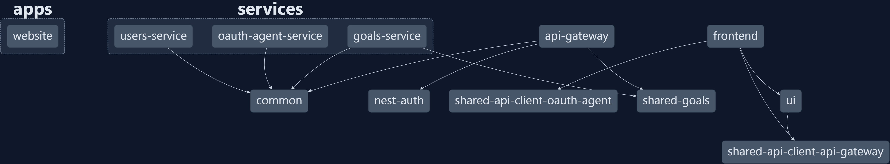

# Project Structure

The project was created using the [Nx](https://nx.dev/) monorepo tool. The project is organized into apps, services, and libraries. Nx is a tool that helps you develop full-stack applications using a monorepo. Nx helps you develop applications using a component-driven approach. Nx also helps you develop applications using a microservices architecture.

The frontend apps are built using [Angular](https://angular.io/). The backend microservices are built using [NestJS](https://nestjs.com/). The project is organized as follows:

## Apps

### [Frontend](../project-structure/apps/frontend)

### [Website](../project-structure/apps/website)

## Services

### [API Gateway](../project-structure/services/api-gateway)

### [Goals Service](../project-structure/services/goals-service)

### [OAuth Agent Service](../project-structure/services/oauth-agent-service)

### [Users Service](../project-structure/services/users-service)

### [Curity Identity Server (3rd Party)](../project-structure/services/curity-identity-server)

## Libraries

### [Common](../project-structure/libraries/common)

### [API Gateway API Client](../project-structure/libraries/api-gateway-api-client)

### [OAuth Agent API Client](../project-structure/libraries/oauth-agent-api-client)

### [Shared Goals](../project-structure/libraries/shared-goals)

### [UI](../project-structure/libraries/ui)
